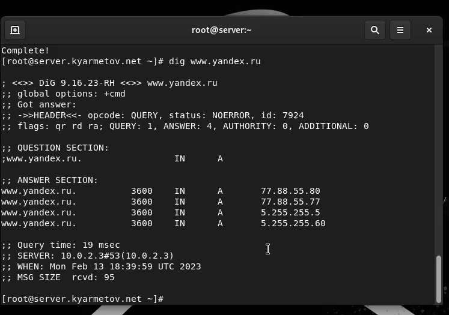
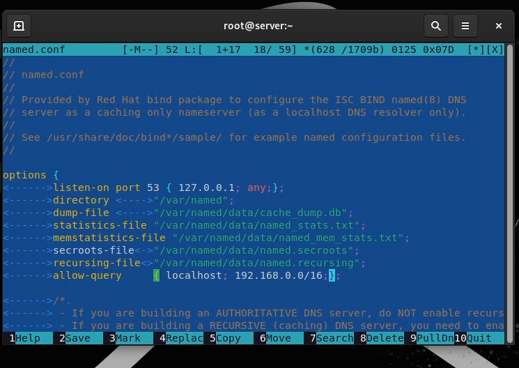
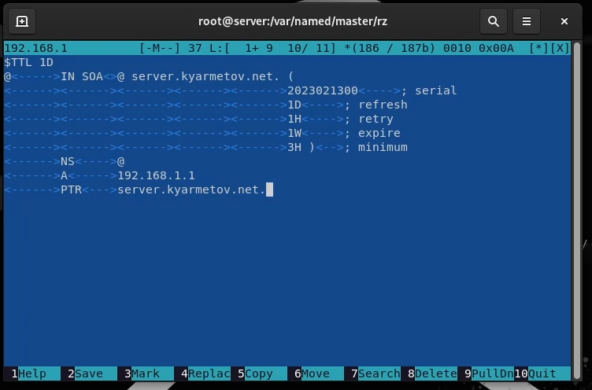

---
## Front matter
lang: ru-RU
title: Лабораторная работа 2
author: Ярметов Камран
institute: Российский Университет Дружбы Народов
date: 13 февраля, 2023, Москва, Россия

## Formatting
mainfont: PT Serif
romanfont: PT Serif
sansfont: PT Sans
monofont: PT Mono
toc: false
slide_level: 2
theme: metropolis
header-includes: 
 - \metroset{progressbar=frametitle,sectionpage=progressbar,numbering=fraction}
 - '\makeatletter'
 - '\beamer@ignorenonframefalse'
 - '\makeatother'
aspectratio: 43
section-titles: true

---

## Цель лабораторной работы

Приобретение практических навыков по установке и конфигурированию DNS-сервера, усвоение принципов работы системы доменных имён.

# Выполнение лабораторной работы

## Запрос к DNS-серверу

{ #fig:001 width=70% height=70%}

## Настройка DNS-сервера

{ #fig:002 width=70% height=70%}

## Настройка DNS-сервера

{ #fig:003 width=70% height=70%}

## Настройка DNS-сервера

{ #fig:004 width=70% height=70%}

## Настройка DNS-сервера

{ #fig:005 width=70% height=70%}

## Прверка DNS-сервера

{ #fig:006 width=70% height=70%}

## Результаты выполнения лабораторной работы

Я приобрел практические навыки по установке и конфигурированию DNS-сервера, усвоение принципов работы системы доменных имён.