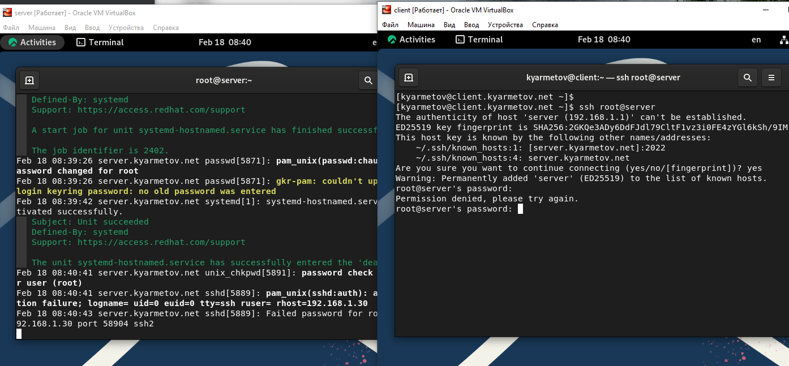
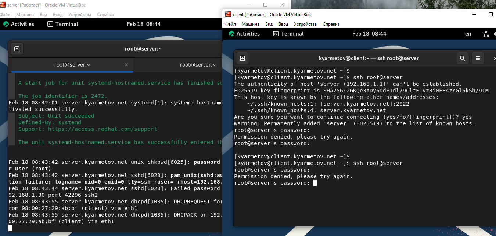
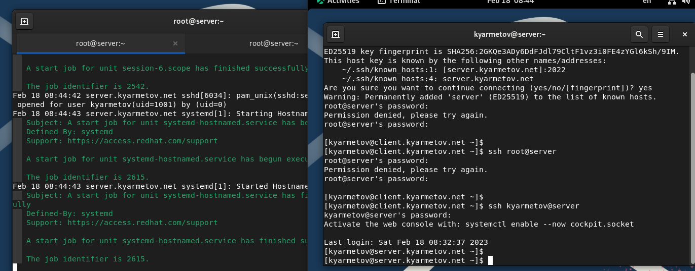
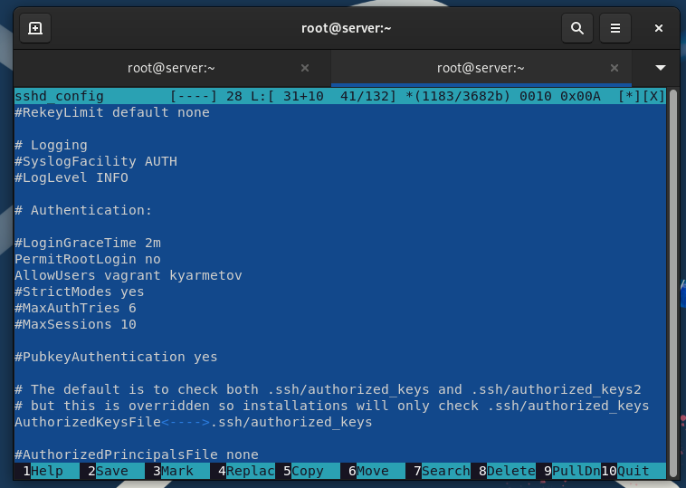
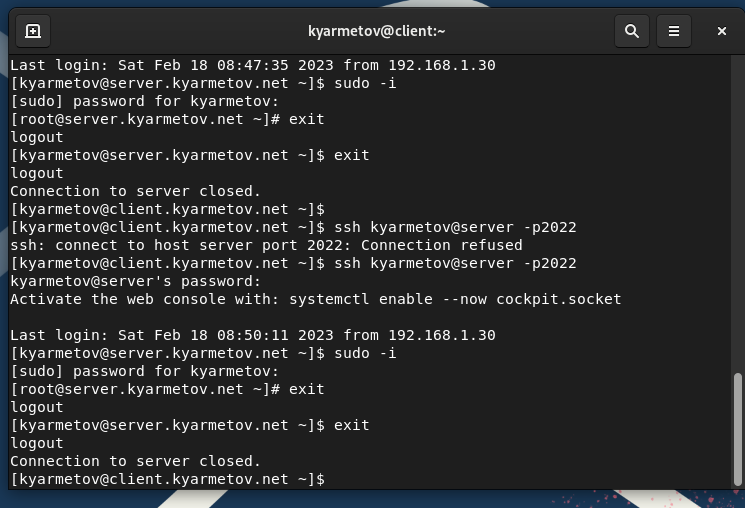
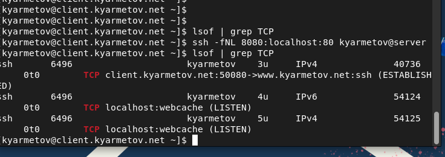
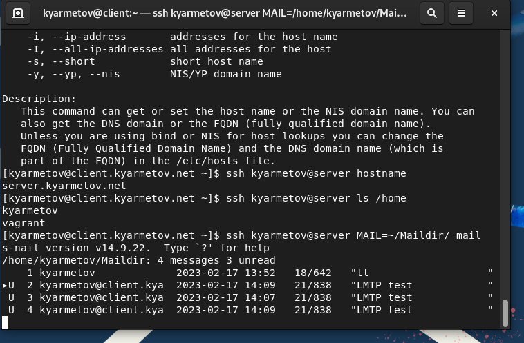
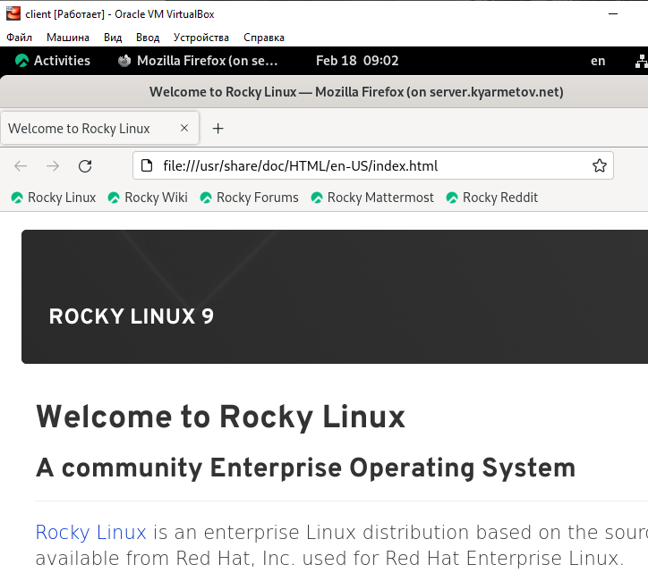

---
## Front matter
lang: ru-RU
title: Лабораторная работа 11
author: Ярметов Камран
institute: Российский Университет Дружбы Народов
date: 17 февраля, 2023,, Москва, Россия

## Formatting
mainfont: PT Serif
romanfont: PT Serif
sansfont: PT Sans
monofont: PT Mono
toc: false
slide_level: 2
theme: metropolis
header-includes: 
 - \metroset{progressbar=frametitle,sectionpage=progressbar,numbering=fraction}
 - '\makeatletter'
 - '\beamer@ignorenonframefalse'
 - '\makeatother'
aspectratio: 43
section-titles: true

---

## Цель лабораторной работы

Приобретение практических навыков по настройке удалённого доступа к серверу с помощью SSH. 

# Выполнение лабораторной работы

## Тестирование SSH-авторизации

{ #fig:001 }

## Тестирование SSH-авторизации

{ #fig:002 }

## Тестирование SSH-авторизации

{ #fig:003 }

## Конфигурация SSH

{ #fig:004 width=70% height=70%}

## Настройка дополнительных портов

{ #fig:005 }

## Настройка удалённого доступа по SSH по ключу 

{ #fig:006 }

## Перенаправление портов

{ #fig:007 width=70% height=70%}

## Удаленное выполнение команд

{ #fig:008 width=70% height=70%}

## Удаленный запуск приложения

{ #fig:009 width=70% height=70%}

## Результаты выполнения лабораторной работы

Приобретены практические навыки по работе с ssh и перенаправлением портов.