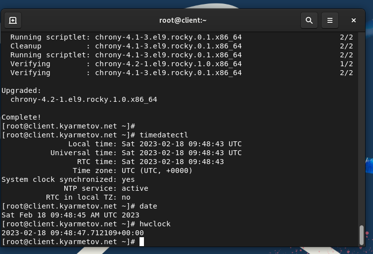
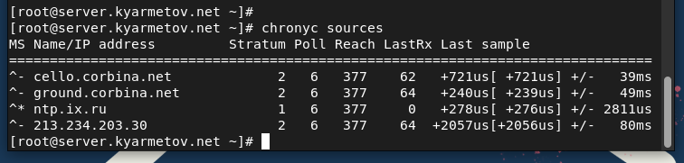
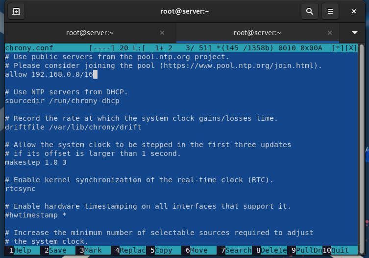
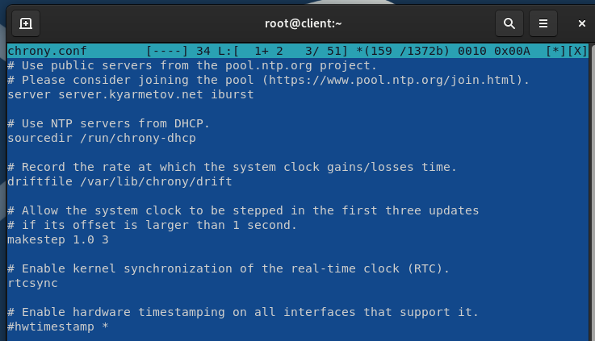
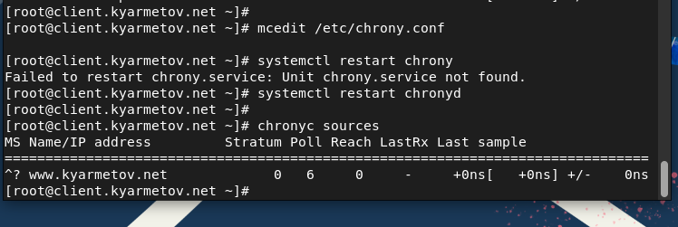

---
## Front matter
lang: ru-RU
title: Лабораторная работа 12
author: Ярметов Камран
institute: Российский Университет Дружбы Народов
date: 17 февраля, 2023,, Москва, Россия

## Formatting
mainfont: PT Serif
romanfont: PT Serif
sansfont: PT Sans
monofont: PT Mono
toc: false
slide_level: 2
theme: metropolis
header-includes: 
 - \metroset{progressbar=frametitle,sectionpage=progressbar,numbering=fraction}
 - '\makeatletter'
 - '\beamer@ignorenonframefalse'
 - '\makeatother'
aspectratio: 43
section-titles: true

---

## Цель лабораторной работы

Получение навыков по управлению системным временем и настройке синхронизации времени. 

# Выполнение лабораторной работы

## Настройка времени

{ #fig:001 width=70% height=70% }

## Управление синхронизацией времени 

{ #fig:002 width=70% height=70% }

## Создание собственного NTP-сервера

{ #fig:003 width=70% height=70% }

## Конфигурация клиента NTP

{ #fig:004 width=70% height=70%}

## Проверка синхронизации

{ #fig:005 }

## Результаты выполнения лабораторной работы

Приобретены практические навыки по работе со службой синхронизации времени