---
## Front matter
lang: ru-RU
title: Лабораторная работа 13
author: Камила Мухтарова НПИбд-01-20
institute: Российский Университет Дружбы Народов
date: 21 декабря, 2022, Москва, Россия

## Formatting
mainfont: PT Serif
romanfont: PT Serif
sansfont: PT Sans
monofont: PT Mono
toc: false
slide_level: 2
theme: metropolis
header-includes: 
 - \metroset{progressbar=frametitle,sectionpage=progressbar,numbering=fraction}
 - '\makeatletter'
 - '\beamer@ignorenonframefalse'
 - '\makeatother'
aspectratio: 43
section-titles: true

---

## Цель лабораторной работы

Приобретение навыков настройки сервера NFS для удалённого доступа к ресурсам. 

# Выполнение лабораторной работы

## Настройка сервера NFSv4 

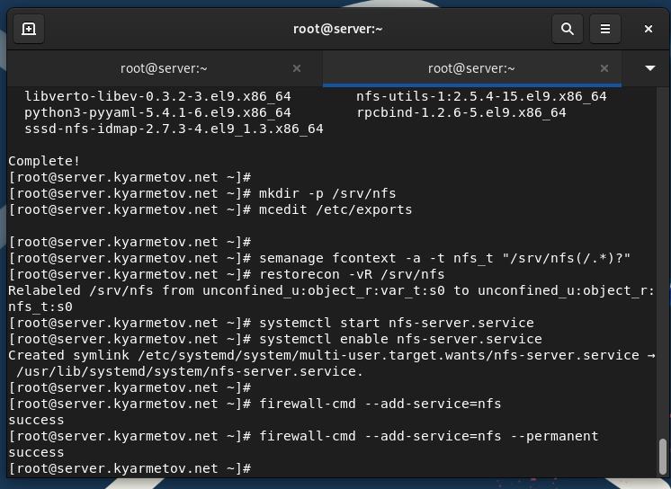{ #fig:001 width=70% height=70%}

## Настройка сервера NFSv4 

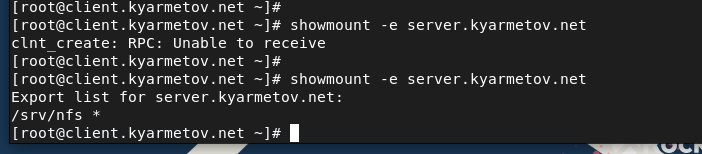{ #fig:002 width=70% height=70%}

## Монтирование NFS на клиенте

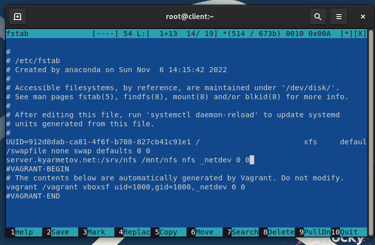{ #fig:003 width=70% height=70%}

## Монтирование NFS на клиенте

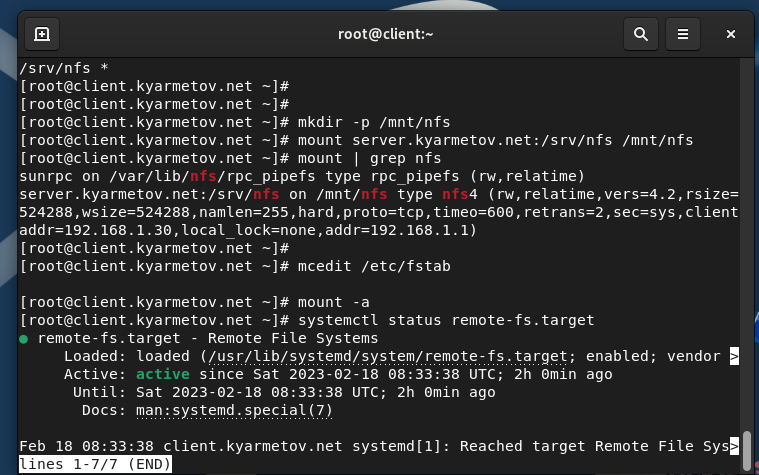{ #fig:004 width=70% height=70%}

## Подключение каталогов к дереву NFS

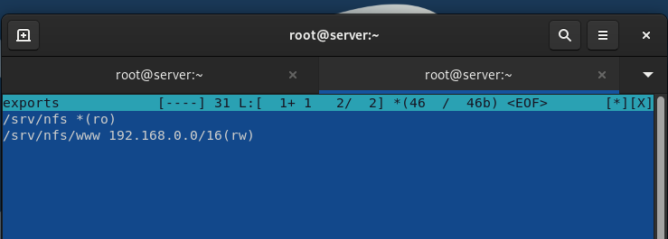{ #fig:005 width=70% height=70%}

## Подключение каталогов к дереву NFS

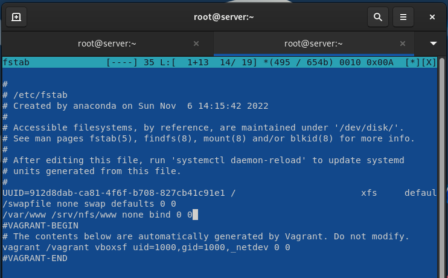{ #fig:006 width=70% height=70%}

## Подключение каталогов к дереву NFS

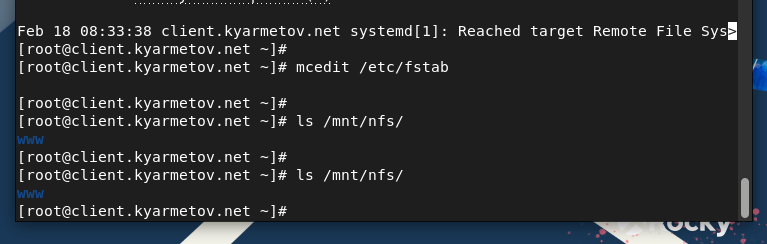{ #fig:007 width=70% height=70%}

## Подключение каталогов для работы пользователей 

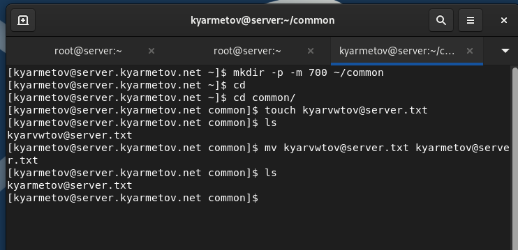{ #fig:008 width=70% height=70%}

## Подключение каталогов для работы пользователей 

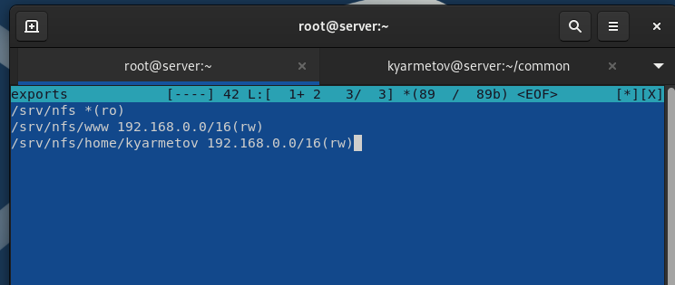{ #fig:009 width=70% height=70%}

## Подключение каталогов для работы пользователей 

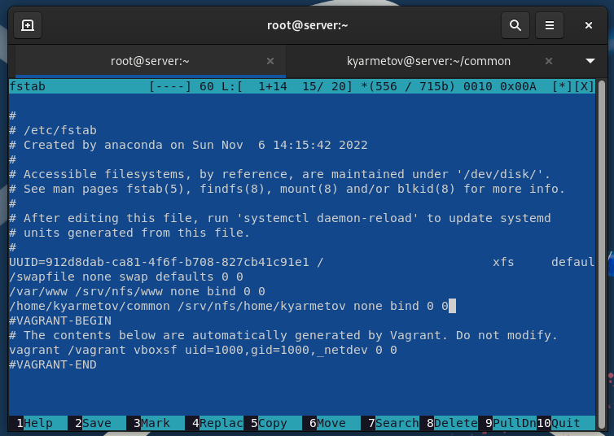{ #fig:010 width=70% height=70%}

## Подключение каталогов для работы пользователей 

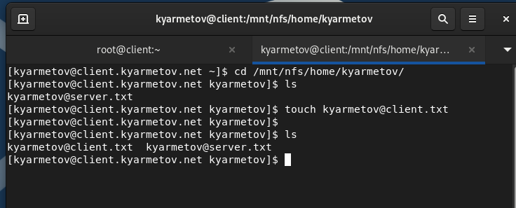{ #fig:011 width=70% height=70%}

## Результаты выполнения лабораторной работы

Приобретены практические навыки по настройке службы NFS.